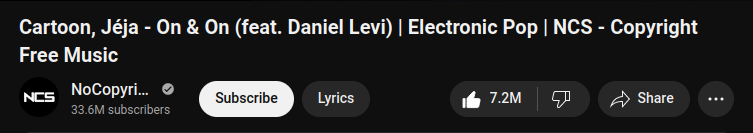
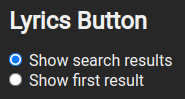

# lyrics-button
Firefox add-on to search lyrics from a youtube song.

## How to use
First [download](https://addons.mozilla.org/en-US/firefox/addon/lyrics-button/) the extension and open a YouTube video.
Then you can press the 'Lyrics' button to do the search:

## More 
In the toolbar you can choose if you want to see the search results or directly take the first one:
